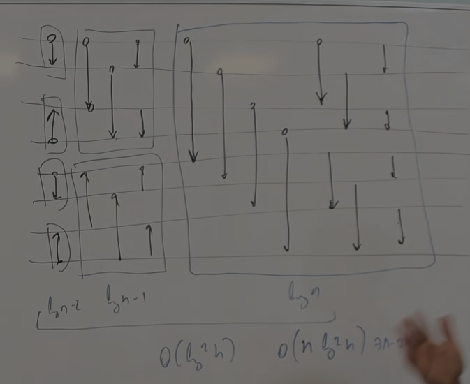

# Сортировки, использующая природу данных

В прошлый раз обсуждалось, что, если умеем только сравнивать, то быстрее, чем за $n \log n$ не получится.

## Сортировка подсчётом

Если у нас есть маленькие числа…

```python
for i=0..n-1:
    cnt[a[i]]++
```


$O(n + m)$, $m$ — количество возможных разных значений.

Но это немного читерство, мы можем хотеть сортировать объекты по неким свойствам, которые имеют ограниченное количество разных значений, но сами объекты с совпадающими значениями свойства могут быть разными!

А мы будем сначала за линейное время раскладываем их по спискам, потом проходимся по спискам в нужном порядке и добавляем в ответ.

Однако лучше не создавать лишние списки: достаточно создать всего один — для ответа — заранее посчитав, части с каким значением свойства сколько нужно места.

```python
a = [A2, B1, C1, D0, E2, F2, G0]
cnt = [2, 2, 3]
p[x] — самое левое свободное место в x-й корзине, 
	   инициалихируется префиксной суммой массива cnt
```

```
a
```


Три этапа сортировки подсчётом:

- Подсчёт (cnt)
- Префиксная сумма p[x]
- Запись в ответ

## Мультиразрядная сортировка

Пусть теперь:

- $a[0...n-1]$
- $a_i \in [0...m^2-1]$

$m^2$ - это уже как-то многовато, чтобы было $O$ от него…

Если есть числа до $m^2$, то можно разложить в m-ичную систему счисления, а потом отсортировать сначала по старшему разряду, а потом — по младшему.

Первая идея: делаем всё это *in-place*, сначала по старшему, а потом, сохраняя местоположения бакетов, по младшему в каждом их них.

Но так как $O(n + m)$, то будет $\sum n_i + m_i = n + m^2$

***Правильный вариант***: сортировать по сначала по младшему разряду, потом — по старшему (казалось бы, контринтуитивно). Помним, что сортировка стабильная, поэтому при втором проходе по старшему (так как в роли изначального положения *выступает величина* младшего разряда).

## Цифровая сортировка

$a_i \in [0, m^k - 1]$

$O((n + m) \cdot k)$

> Магии с целочисленными типами без знания природы не произойдёт, так как $k \approx \log INT\_MAX$


## Отвлечёмся на ≈ дискретку (сортировочные сети)

Пусть у нас есть операция (формально - компаратор) $kek(i, j)$:

```python
def kek(i, j):
    if a[i] > a[j]:
        swap(a[i], a[j])
```

Мы можем общаться с массивом только посредством её. Попробуем сделать как можно более оптимальную $kek\_sort$.

Почему это в принципе работает? Можно, например, сделать пузырёк:

```python
def bubble_kek_sort():
    for i=n-1..0:
        for j=0..i-1:
            kek(j, j + 1)
```

Есть специальные красивые диаграммы для обозначения такого...

Мы хотим распараллелить сортировку настолько, насколько это возможно.

### Битоническая сортировка

Позволяет сильно распараллелить сортировку.

Сортирует битонические последовательности.

> ***Битоническая последовательность***: некий циклический сдвиг унимодальной последовательности (получается, последний элемент почти совпадает с первым)

Имеет ***глубокий*** практический смысл. Например, такие последовательности возникают, если двигаться лучом из точки по многоугольнику.

### Важная теорема

> ***Теорема***: сортирующая сеть сортирует! (…любой массив, если сортирует любой из нулей и единиц)

(в одну сторону легко…)

Докажем в обратную. Слева у сети входы, справа выходы, посередине — некая магия. 

Докажем для перестановки, этого — понятно — достаточно. 

Возьмём массив, найдём в нём минимальный элемент, рассмотрим (только в уме) маску, где только он НОЛЬ.

Заметим, что он попадёт на первое место. Минимальный элемент в массиве двигается по тому же маршруту, что и нолик, а значит, и минимальный элемент попадёт на нужное место.

Затем рассмотрим второй элемент, сделаем первый и его нулями, тогда они попадут на первые два места, но второй попадёт на второе, так как на первом уже точно первый

И т.д. Чтд.

___

 Как выглядит битоническая последовательность нулей и единиц?

Только 2 варианта:
$$
\left[
\begin{gathered}
	00\dots0011\dots11110000\dots0000 \\
	11\dots1100000\dots0000011\dots11
\end{gathered}
\right.
$$


Предложим такую сеть (количество элементов = $2^n$): 

Делим пополам, из каждого элемента добавляем стрелочку к соответствующему ему из второй половины.

Докажем, что после такого:

> Если на вход в полуфильтр подать битоническую последовательность из нулей и единиц длиной *n*, то на выходе мы получим две битонические последовательности длиной $\frac n2$ такие, что каждый элемент из верхней последовательности не превосходит любой элемент из нижней, и что одна из них будет **однородной** (англ. *clean*) — целиком состоящей либо из нулей, либо из единиц. 

_______

Затем делаем рекурсию, но можно обрабатывать все «вызовы» параллельно.

Таким образом, делаем такие шаги, пока не разобьём до 1 элемента.

У нас глубина $≈log$, $n \log n$ компараторов, $n$ слоёв.

______

Но как сделать последовательность битонической? Давайте отсортируем одну часть по возрастанию, другую по убыванию. Как? Рекурсивно! (пока не достигли длины $2$)



В сумме слоёв:
$$
\log n + \log n - 1 + \dots = O(\log^2 n)
$$
Можно сделать и сортирующую сеть и глубиной $\log$ элементов, но он ужасно сложен и такая константа, что элементов 