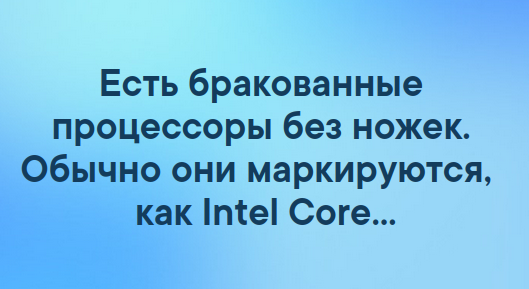

# Архитектура ЭВМ

Порядок проведения курса (Радмила Чинаева)

>Основной препод: ***Павел Сергеевич Скаков***
>70 баллов за домашки.
>Максимальная потенциальная сумма баллов за домашки 80, но ставится max(баллы, 70)
>30 баллов за устный зачет в конце.
>Зачет «в духе экзамена» (?...).
>Зачет дифференцированный (вероятно, имеется ввиду, что есть оценки), поэтому для нас от экзамена отличаться не будет ничем (?).
>Будем писать тесты. 3 теста по первым трем лекциям. (Исправьте числа если я не так услышала.)
>Нужно отправлять отчет по дз, устной сдачи нет, но если есть проблемы, можно поговорить.
>Дедлайны жесткие, даже с опозданием на 6 секунд не примут.
>Вопросы по дз писать Яковлевой. Но она просит погуглить, прежде чем задавать ей вопросы. Отвечать обещает в течение суток. Если писать вечером в день дедлайна, можно и не дождаться ответа.
>После проверки будет табличка с со столбиками-критериями оценивания.
>Пересдавать дз нельзя. 
>Допуск к зачету - 40 баллов.
>В среднем люди набирают на зачете 12-15 баллов.
>На зачете может быть то, чего не было на лекции, но было в домашке. На лекции рассказываются все общие идеи, читать дополнительно по идее не надо.
>Литература: Таненбаум. 
>В курсе более свежая информация, чем в книге.
>Для подробной и актуальной информации читать стандарты.
>Рекомендуется гуглить и читать на английском. Информации гораздо больше.
>Не рекомендуется читать русскую википедию. Ее переводят криво. Английскую читать можно. Снизу можно найти ссылки на более подробные статьи. Только википедии для подготовки к зачету не хватит.
>Нужно говорить, что начался перерыв, иначе его не будет.

## Зачем нужен предмет

Чтобы отличать бракованные процессоры от нормальных:

